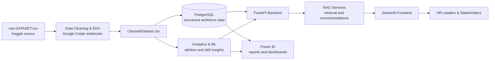

<div align="center">

# Workforce Insights Dashboard for Employee Skill and Analytics

### Transforming Workforce Data into Intelligent Business Decisions

<p align="center">
  
  
  
</p>

</div>

**Infosys Springboard Virtual Internship Program 7.0**  
**Batch:** Batch-2  
**Project Group:** Group 1  
**Mentor:** Neha mam  
**Mentor Email:** springboardmentor5262@gmail.com

## Overview

This project focuses on building an Workforce Insights Dashboard for Employee Skill and Analytics that helps organizations make faster and better decisions across workforce planning, employee engagement, talent development, diversity, attrition, recruitment effectiveness, and organizational health.

The solution combines large language models, retrieval-augmented generation, predictive analytics, semantic search, and agentic AI workflows to transform fragmented HR data into strategic business intelligence. It is designed to support HR leaders, business stakeholders, and executives with real-time insights and conversational access to workforce information.

## Project Objective

The objective of this project is to create a unified intelligence platform that can:

- Integrate workforce data from major HRMS and talent systems.
- Clean, transform, and model workforce-related datasets.
- Generate semantic embeddings and knowledge indexes for retrieval and reasoning.
- Predict attrition risk, talent gaps, and workforce trends.
- Surface actionable recommendations for retention, planning, and skill development.
- Provide an interactive dashboard and conversational analytics experience.

## Key Outcomes

- Comprehensive visibility into workforce performance, demographics, and organizational trends.
- Predictive analytics to identify attrition risks and proactive retention strategies.
- Actionable insights into employee skills, learning progress, and career development.
- Monitoring of diversity, equity, and inclusion metrics across the organization.
- Intelligent AI-powered recommendations for workforce planning and engagement.
- Natural language interaction for rapid, data-driven workforce intelligence.

## Milestones

### Milestone 1

- Study workforce data requirements and define system analytics specifications.
- Design repository architecture, database schema, and data integration pipelines.
- Develop secure mechanisms for connecting to SAP, Workday, and other HR data sources.
- Implement initial data cleansing, transformation, and storage workflows for workforce datasets.

### Milestone 2

- Develop AI analysis workflows for automated workforce trend monitoring and predictive insights.
- Implement machine learning models for attrition prediction and skill gap analysis.
- Create validation scripts for auditing prediction accuracy against historical workforce outcomes.
- Validate engine performance in generating reliable health scores and talent recommendations.

### Milestone 3

- Integrate the core analytics engine with the interactive workforce intelligence dashboard.
- Develop visualization modules for tracking headcount, diversity metrics, and engagement trends.
- Implement reporting modules for executive summaries and strategic talent intelligence reports.
- Create role-based collaboration tools for HR leaders and business stakeholders.

### Milestone 4

- Develop automated feedback loops for refining AI predictions and forecasting models.
- Generate performance reports, talent benchmarking summaries, and organizational health reviews.
- Conduct cloud deployment, system testing, and recommendation effectiveness evaluation.
- Prepare project documentation, technical report, and final demonstration.

## Project Structure

The repository is organized as an end-to-end workforce intelligence and RAG platform:

```text
Workforce-Insights-Dashboard-for-Employee-Skill-and-Analytics/
├── .github/workflows/               # GitHub Actions workflows
├── raw-DATASET.csv                  # Uncleaned employee data sourced from Kaggle
├── dashboard.pbix                   # Power BI dashboard
├── Project Report.pdf               # Complete project report
├── Presenttion PPT.pptx             # Project presentation deck
├── Deployment & Setup Guide.md      # Local deployment and setup instructions
├── backend/                         # FastAPI backend and RAG services
│   ├── app/                         # API, core logic, models, routers, schemas, and services
│   ├── migrations/                  # Database migration configuration and revisions
│   ├── scripts/                     # Backend setup and administration scripts
│   ├── .env.example                 # Backend environment variable template
│   └── requirements.txt             # Backend dependencies
├── frontend/                        # Streamlit workforce insights dashboard
│   ├── app.py                       # Application entry point
│   ├── services/                    # Backend/API integration services
│   ├── ui_pages/                    # Dashboard, assistant, admin, and data pages
│   ├── utils/                       # Session and shared frontend utilities
│   ├── .streamlit/                  # Streamlit configuration
│   └── requirements.txt             # Frontend dependencies
├── Data_Cleaning/
│   ├── CleanedDataset.csv           # Dataset after the data-cleaning process
│   ├── Data Integration.ipynb       # Data integration workflow notebook
│   ├── Data_Cleaning_EDA_ML.ipynb   # Data cleaning, EDA, and ML notebook
│   └── Images/                      # EDA charts and key findings
├── Documents/                       # Project templates and testing documents
│   ├── Agile_Template_v0.2.xlsx
│   ├── Defect_Tracker Template_v0.2.xlsx
│   └── Unit_Test_Plan_v0.1.xlsx
├── scripts/                         # Repository maintenance and automation scripts
├── contributors.json                # Contributor manifest
└── README.md                        # Project documentation
```

> **Data lineage:** `raw-DATASET.csv` is cleaned and explored in `Data_Cleaning/`, then the resulting insights support the dashboard, analytics, and RAG workflows.

## Solution Architecture

The platform connects data preparation, persistence, retrieval, analytics, and user-facing insight delivery in one workflow:



### Architecture Layers

| Layer | Responsibility | Primary technologies |
| --- | --- | --- |
| Data foundation | Ingest, clean, validate, and integrate workforce data | CSV, Python, Pandas, Google Colab |
| Persistence | Store structured workforce data for reliable access | PostgreSQL, SQLAlchemy, Alembic |
| Intelligence | Generate analytics, retrieval context, and recommendations | RAG, embeddings, machine learning |
| API and services | Expose secure application and analytics capabilities | FastAPI, Python |
| Experience | Provide dashboards and conversational workforce insights | Streamlit, Power BI |
| Communication | Present project findings and implementation outcomes | MS PowerPoint, Project Report |

## Documents

<p align="center">
  <a href="https://1drv.ms/x/c/e932a70d90ac84a4/IQCDXRCpdXb3Q6L5XYM8dzvOAXGwN1OH6j1I-6wdH0W4seA" target="_blank" rel="noopener noreferrer">
    
  </a>
  <a href="https://1drv.ms/x/c/9bec95ec5bdab646/IQDJP2i0YiWUQKafu6-x6qh0AdkGqWqXsxYnFJxHAUbEIs4?e=FLIgYU" target="_blank" rel="noopener noreferrer">
    
  </a>
  <a href="https://1drv.ms/x/c/9bec95ec5bdab646/IQAXrpZdbNd_Qq9hzCl7z9jmAY7jMbijmysO2CwlEUM-kK8?e=YFHJgX" target="_blank" rel="noopener noreferrer">
    
  </a>
</p>

## Professional Notes

- The project should follow secure handling practices for HR and employee data.
- Any integrations with external HR systems should use authenticated and auditable access patterns.
- Model outputs should be reviewed for fairness, explainability, and confidence calibration before stakeholder use.
- Dashboard metrics should be aligned with business objectives and validated against historical outcomes.

## 🛠 Technology Stack

<p align="center">


</p>

| Category | Technologies and tools |
| --- | --- |
| Programming and API | Python, FastAPI |
| Data engineering | Pandas, NumPy, CSV, Google Colab, Jupyter Notebooks |
| AI and analytics | RAG, semantic search, embeddings, TensorFlow, predictive analytics |
| Database and migrations | PostgreSQL, SQLAlchemy, Alembic |
| Frontend and visualization | Streamlit, Power BI, Matplotlib, Seaborn |
| Documentation and delivery | MS PowerPoint, PDF reporting |
| Development workflow | Git, GitHub, Visual Studio Code |

## License

This project is released under the MIT License. See the [LICENSE](LICENSE) file for full terms.

## 🤝 Contributing

Contributions are welcome through the project repository:
[Workforce Insights Dashboard for Employee Skill and Analytics](https://github.com/Infosys-Springboard-Internship-7-0/Workforce-Insights-Dashboard-for-Employee-Skill-and-Analytics)

### Contribution Steps

1. Fork the repository and create a feature branch.
2. Review the project scope, milestones, and existing documentation.
3. Add or update code, documentation, or datasets in a focused commit.
4. Add your details to [contributors.json](contributors.json) using the required fields: name, contact, course, college, address, and GitHub username.
5. Validate your changes locally before submitting.
6. Open a pull request with a clear summary of the contribution.

### Contributors

The current contributor manifest is maintained in [contributors.json](contributors.json). Add approved contributor records there so they appear in the official project roster.

## Project Contributors

The contributor roster is sourced from [contributors.json](contributors.json) and is updated automatically by the GitHub pipeline.

<!-- CONTRIBUTORS:START -->
| Avatar | Name | Contact | Course | College | Address | GitHub Username |
| --- | --- | --- | --- | --- | --- | --- |
|  | Saurabh Kumar | contact@gu-saurabh.site | BCA | Galgotias University | Greater Noida, UP | [Saurabhtbj1201](https://github.com/Saurabhtbj1201) |
|  | Aishwarya Zade | aishwaryazade2002@gmail.com | BTech | LSPGCOE Ratnagiri | Gadchiroli, Maharashtra | [Ashuzade](https://github.com/Ashuzade) |
|  | Pratyush Sarkar | pratyush2003sarkar@gmail.com | B.Tech CSE | University of Engineering and Management | Kolkata, West Bengal | [Pratyush562003](https://github.com/Pratyush562003) |
|  | Sanjivani Gurav | sanjivanigurav106@gmail.com | Msc | Vivekanand College, Kolhapur | Pune, Maharashtra | [Sanjivani0101](https://github.com/Sanjivani0101) |
|  | Disha Pramanick | pramanickdisha88@gmail.com | BCA | B.P. Poddar Institute of Management & Technology | Kolkata, West Bengal | [01Dishapramanick](https://github.com/01Dishapramanick) |
|  | Moulikea Murugesan | moulikeamurugesan2004@gmail.com | MCA | M.Kumarasamy College of Engineering | Erode, Tamilnadu | [Moulikea](https://github.com/Moulikea) |
|  | Anil Yaka | yakaanil2006@gmail.com | B.Tech CSE(AI&ML) | Anil Neerukonda Institute of Technology and Sciences | Visakhapatnam, Andhra Pradesh | [Yakaanil2006](https://github.com/Yakaanil2006) |
|  | Tetali Thanvika | thanvikathanvi02@gmail.com | B.Tech ,IOT | Seshadri Rao Gudlavalleru Engineering College | Tanuku, Andhra Pradesh | [thanvikathanvi02-hub](https://github.com/thanvikathanvi02-hub) |
<!-- CONTRIBUTORS:END -->

---

<div align="center">
Made with ❤️ by the Infosys Springboard Internship 7.0 Team
</div>
